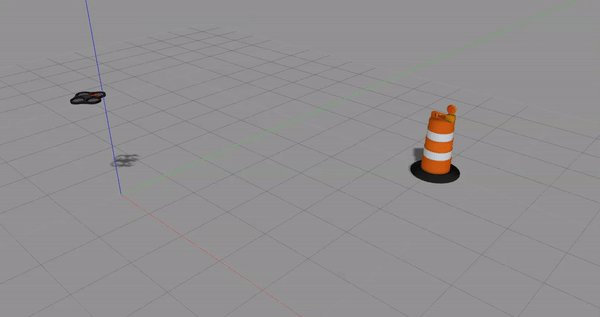

# Autonomous UAV Navigation Using Sample-based and Reinforcement Learning Methods

## RRT star and RRT with Minimum snap
The RRT and RRT star method with Minimum snap trajectory generation. To see technical details, please take a look at our [report](https://github.com/ChrisSun99/uav_motion_planner/blob/main/ESE650_Final_Project.pdf).


### Installation

1. Create a new Python virtual environment and activate it.
2. Run the following:

```bash
cd sample-based
cd src/
python setup.py install
```

To ensure the simulator is running, at least it should print the following:

```bash
Simulate.
Failure: Your quadrotor is out of control; it flew away with a position error greater than 20 meters.
```

indicating that the simulator works, no matter whether the simulation is successful or not.

After simulation, it should pop up in multiple Matplotlib windows. One of them is "Animation", and another one is "3D Path" which draws the entire path of the quadrotor in 3D space.

### Running

Run the algorithm `python core/code/sandbox.py`. By default, it should produce

```bash
----- Solving time optimization problem...
----- Solve maximum time reached.
Reach time before optimization:
[2. 4. 2.]
Reach time after optimization:
[1.63984032 4.43712496 1.92303472]
Simulate with time optimized.
Success: End reached.
```

### Configurations

A list of configurable Python arguments can be seen when typing

```bash
python sandbox.py --help
```

which should include at least the following:

```bash
usage: sandbox.py [-h] [-s] [-e] [-f WORLD_FILE]

Accepts various command line arguments.

optional arguments:
  -h, --help            show this help message and exit
  -s, --save_to_disk    Save the animation to disk at ./data/out.mp4.
  -e, --empty_world     Create an empty world instead of from a pre-configured file.
  -f WORLD_FILE, --world_file WORLD_FILE
                        World config JSON file location
```

You can alter the initial waypoint locations to test different shapes of trajectories in `sandbox.py`:

```Python
# You will complete the implementation of the WaypointTraj object. It should
# work for any list of 3D coordinates, such as this example:
points = np.array([
    [0, 0, 0],
    [2.5, 0, 0],
    [2.5, 5, 0],
    [0, 5, 0]])
my_traj_noop = waypoint_traj.WaypointTraj(points, total_T=8, optimize_time=False)
my_traj = waypoint_traj.WaypointTraj(points, total_T=8, optimize_time=True)
```

You can also define different worlds with different obstacle locations by creating a new json file in `src/core/code/worlds/`. The boundary of the world should be specified in

```json
"bounds": {"extents": [0, 4.5, 0, 6.5, -1.0, 3.0]},
```

with the data format `[xmin, xmax, ymin, ymax, zmin, zmax]`, and the obstacles

```json
"blocks": [
        {"extents": [0.0, 0.5, 0.0, 0.5, -1.0, 3.0], "color": [1, 0, 0]},
        {"extents": [0.0, 0.5, 2.0, 2.5, -1.0, 3.0], "color": [1, 0, 0]},
        {"extents": [0.0, 0.5, 4.0, 4.5, -1.0, 3.0], "color": [1, 0, 0]},
        {"extents": [0.0, 0.5, 6.0, 6.5, -1.0, 3.0], "color": [1, 0, 0]},
        {"extents": [2.0, 2.5, 0.0, 0.5, -1.0, 3.0], "color": [1, 0, 0]},
        {"extents": [2.0, 2.5, 2.0, 2.5, -1.0, 3.0], "color": [1, 0, 0]},
        {"extents": [2.0, 2.5, 4.0, 4.5, -1.0, 3.0], "color": [1, 0, 0]},
        {"extents": [2.0, 2.5, 6.0, 6.5, -1.0, 3.0], "color": [1, 0, 0]},
        {"extents": [4.0, 4.5, 0.0, 0.5, -1.0, 3.0], "color": [1, 0, 0]},
        {"extents": [4.0, 4.5, 2.0, 2.5, -1.0, 3.0], "color": [1, 0, 0]},
        {"extents": [4.0, 4.5, 4.0, 4.5, -1.0, 3.0], "color": [1, 0, 0]},
        {"extents": [4.0, 4.5, 6.0, 6.5, -1.0, 3.0], "color": [1, 0, 0]}
    ]
```

with the data entry using the same format.


### Results

You can get waypoints in `src/core/code/output/rrt_3d.html` after you run `sandbox.py`.

If you save the animation, you can get it in `src/core/code/data/out.mp4`

Here are example waypoints and trajectories of RRT star:


### References

D. Mellinger and V. Kumar, "Minimum snap trajectory generation and control for quadrotors," _2011 IEEE International Conference on Robotics and Automation_, 2011, pp. 2520-2525, doi: 10.1109/ICRA.2011.5980409. [IEEE Xplore]

Karaman, Sertac, and Emilio Frazzoli. "Sampling-based algorithms for optimal motion planning." *The international journal of robotics research* 30.7 (2011): 846-894.

LaValle, Steven M. "Rapidly-exploring random trees: A new tool for path planning." (1998): 98-11.


## Q-learning for UAV Autonomous Navigation 
This repository contains the source code for implementing Q-learning algorithm for ARDrone autonomous navigation. 

### Dependencies 
* Ubuntu 16.04 
* ROS Kinetic 
* [Gazebo 7](https://gazebosim.org/home)
* [ardrone_autonomy](https://github.com/AutonomyLab/ardrone_autonomy)
* [gym](https://gym.openai.com/docs/)
* [gym-gazebo](https://github.com/erlerobot/gym-gazebo)
* Python 2.7

### Installation
1. Install all the dependencies
2. Create a workspace for the motion planner

```
cd ~/catkin_ws/
catkin init
catkin_build
```
3. Put the package in `~/catkin_ws/src`. Then in the `src` directory, do
```
git clone https://github.com/pulver22/QLAB
git clone https://github.com/tum-vision/tum_ardrone
```
5. Build the workspace
```
cd ..
catkin_make
```

### Getting Started 

To start the Q-learning training, 
```
roslaunch uav_nav world.launch
roslaunch uav_nav start_qlearning.launch
```
### Results 


### Reference 
* Pham, Huy X., et al. [Autonomous UAV Navigation using Reinforcement Learning](https://arxiv.org/abs/1801.05086)


## Contribution 
* Xuanbiao Zhu: Implement RRT and RRT* 
* Mengti Sun: Q-learning, PID Control, Gazebo Simulation
* Li Shen: LQR and Minimum Snap 